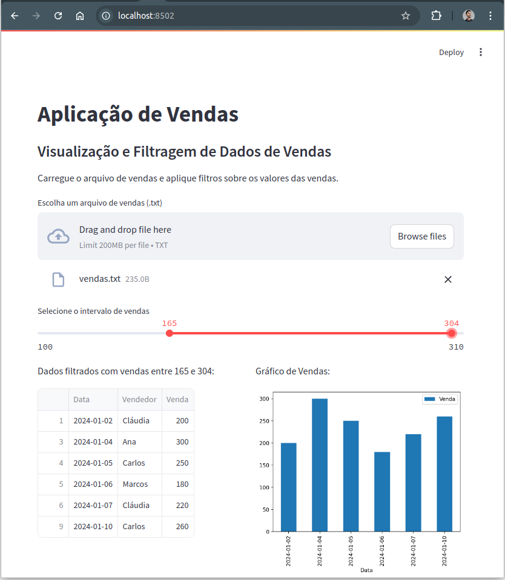

# Criando seu 1º App com Streamlit 

O ***Streamlit*** é uma poderosa ferramenta de desenvolvimento focada na criação de ***aplicações web*** interativas e dinâmicas de forma simples e rápida. Ele foi desenvolvido para facilitar a construção de ***dashboards*** e aplicações voltadas para ***dados***, permitindo que desenvolvedores, analistas e cientistas de dados transformem scripts Python em interfaces web completas com ***pouquíssimo esforço***. Utilizando uma sintaxe intuitiva, o Streamlit elimina a necessidade de conhecimento avançado em frontend ou desenvolvimento web, o que o torna ideal para projetos de visualização e manipulação de dados, apresentações interativas e até mesmo para protótipos de aplicações mais complexas.

Este ***aplicativo*** de base de vendas foi projetado para facilitar a análise de dados de vendas de maneira ***interativa*** e ***intuitiva***. Utilizando o Streamlit como base, o app permite que o usuário carregue um arquivo de vendas em formato ```.txt``` e aplique filtros sobre os valores de vendas através de um controle deslizante. Além disso, o aplicativo exibe os dados filtrados e gera ***gráficos de barras*** para uma visualização clara do desempenho das vendas ao longo do tempo. Com uma interface amigável e funcionalidades práticas, o app torna a ***exploração de dados*** de vendas rápida e acessível, permitindo ***insights valiosos*** em poucos cliques.

<!--
https://www.youtube.com/@renato-coelho
-->

# Apresentação em vídeo

<p align="center">
  <a href="https://youtu.be/MootfcRPVuc" target="_blank"></a>
</p>


### Requisitos

+ 

+ 

+ 

+ 


## Deploy da aplicação


### Clonando o repositório

```bash
git clone https://github.com/Renatoelho/streamlit-app-vendas.git streamlit-app-vendas
```


### Preparando o ambiente

+ Acessando o diretório clonado
```bash
cd streamlit-app-vendas/app/
```

+ Criando o ambiente virtual
```bash
python3.9 -m venv .venv
```

+ Ativando o ambiente virtual
```bash
source .venv/bin/activate
```

+ Instalando as dependências
```bash
pip install -U pip setuptools wheel --no-cache-dir && pip install -r requirements.txt --no-cache-dir
```

+ Ativando o App Streamlit
```bash
streamlit run app.py
```

> ***OBS.:*** Para acessar o App clique aqui: [http://localhost:8502](http://localhost:8502)

# Tela do App de Vendas

<p align="center">
  </a>
</p>

# Referências

file_uploader, **Streamlit.** Disponível em: <https://docs.streamlit.io/develop/api-reference/widgets/st.file_uploader>. Acesso em: 05 set. 2024.

slider, **Streamlit.** Disponível em: <https://docs.streamlit.io/develop/api-reference/widgets/st.slider>. Acesso em: 05 set. 2024.

container, **Streamlit.** Disponível em: <https://docs.streamlit.io/develop/api-reference/layout/st.container>. Acesso em: 05 set. 2024.

columns, **Streamlit.** Disponível em: <https://docs.streamlit.io/develop/api-reference/layout/st.columns>. Acesso em: 05 set. 2024.

API reference, **Streamlit.** Disponível em: <https://docs.streamlit.io/develop/api-reference>. Acesso em: 05 set. 2024.
